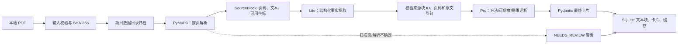
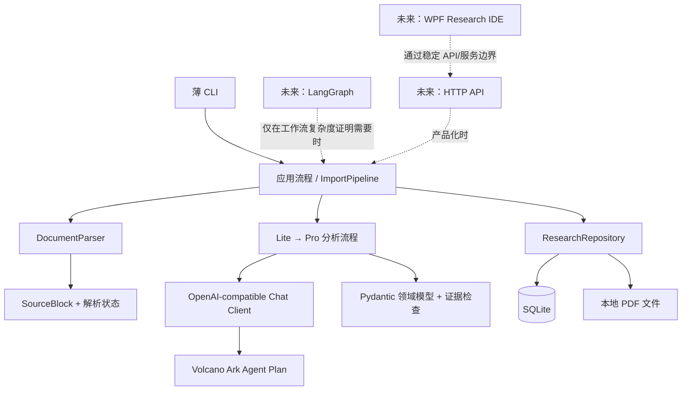

# Sociology Research Agent

本项目从一个本地、可追溯的社会科学论文阅读原型开始。当前框架支持 PDF 导入与解析、Lite → Pro 两阶段结构化分析、证据核验、SQLite 缓存和 Paper Card JSON 导出。自动搜索、跨论文分析和桌面界面尚未接入。

## 快速开始

```powershell
conda create -p .conda-env --override-channels -c conda-forge python=3.12 "pydantic>=2.7,<3" "pymupdf>=1.24,<2" pip
conda run -p .conda-env python -m pip install --no-build-isolation -e .
conda run -p .conda-env sra import-pdf "D:\papers\example.pdf"
conda run -p .conda-env sra list
conda run -p .conda-env sra show PAPER_ID
conda run --no-capture-output -p .conda-env sra ui
conda run --no-capture-output -p .conda-env python scripts/test_ark_connection.py
conda run --no-capture-output -p .conda-env sra analyze PAPER_ID
conda run --no-capture-output -p .conda-env sra analyze PAPER_ID --exclude-after-text "Revisiting Description: Data Deep Description in Quantitative Research"
conda run --no-capture-output -p .conda-env sra analyze PAPER_ID --exclude-after-text "Revisiting Description: Data Deep Description in Quantitative Research" --run
conda run -p .conda-env sra export-card PAPER_ID --output paper-card.json
conda run -p .conda-env sra export-text PAPER_ID --output parsed-paper.txt
```

`conda run` 不要求先初始化或激活 PowerShell。项目依赖版本范围也记录在 `pyproject.toml`。

也可以双击项目根目录的 `start_sra_ui.bat` 启动本地浏览器工作台。界面服务只绑定本机回环地址，默认使用 8765 端口；它用于临时本地调试，不是公开部署的 Web 服务。

## 模型配置

项目根目录的 `.env` 已加入忽略规则，不会随代码提交。把密钥放入 `SRA_API_KEY`；可参考 [.env.example](.env.example)。也可在 PowerShell 当前会话设置 `$env:SRA_API_KEY = "你的密钥"`。代码从环境读取密钥，不打印密钥值。

当前使用火山方舟 Agent Plan 的 OpenAI-compatible Chat Completions，模型名按配置原样发送：`doubao-seed-2.1-lite` 与 `doubao-seed-2.1-pro`。

论文分析分为两个阶段：

```text
PDF 文本块 + 页面证据
  → Lite：元数据、摘要、方法、数据集、指标、表格和关键数字
  → 紧凑基础卡片（每项保留证据引用）
  → Pro：创新点、方法合理性、实验可信度、局限、阅读价值
  → 最终 Paper Card（保留阶段来源和证据）
```

`sra analyze` 默认只做本地预览，显示模型、思考设置、Lite 请求数和输入长度，不发送请求。只有加 `--run` 才调用模型、消耗 Agent Plan 额度；不会自动重试。Lite 默认关闭深度思考以降低提取延迟与用量；Pro 保持思考开启并使用 low reasoning effort。Lite 只输出受限数量的论文事实，表格本体由 PDF 解析器保存，避免模型重复抄写整张表。超时和思考参数放在 [config.py](src/sociology_research/config.py) 的 `AnalysisConfig`，不作为环境变量。`conda run` 默认会缓存子进程输出，模型调用时建议加 `--no-capture-output` 查看实时进度。模型请求不逐 token 流式返回，等待时会每 30 秒显示状态。超时默认为 420 秒。Lite 使用紧凑来源别名减少重复 UUID 的输入开销，Pro 只接收 Lite 结果和精选引文，不重传整篇 PDF。Lite 结果按论文、模型、提示版本和输入内容缓存；Pro 超时后重跑会复用已成功缓存的 Lite 结果。`--force --run` 会强制重跑并消耗额度。研究兴趣是可选项，只影响阅读相关性判断，不影响论文事实提取或方法分析。

`scripts/test_ark_connection.py` 发送一条极短请求，仅验证 Key、Base URL、所选模型和 Chat Completions 连通性；它仍会消耗少量额度，但不会发送论文文本，也不会自动重试。默认测试 Lite；用 `--stage pro` 测试 Pro。

数据默认保存在项目根目录的 `data/`：导入的 PDF 在 `data/papers/`，SQLite 数据库在 `data/research.sqlite3`。可用 `SRA_DATA_DIR` 指向其他数据目录。重复导入相同文件内容会复用已有记录。

扫描 PDF 或无法提取文字的页面会标记为 `needs_review`；损坏、加密或不支持的输入会明确报错。PyMuPDF 会尝试抽取结构化表格行列；排版复杂或无边框表格可能需要人工核验。首版不提供 OCR。

## 当前数据流程



## 架构边界



## 开发与基础检查

使用标准库运行基础防御性检查：

```powershell
conda run -p .conda-env python -m unittest discover -s tests -v
```

检查覆盖数据模型的关键约束、SQLite 往返与缓存、无效 PDF 输入和离线双阶段流程；不替代研究者对真实论文内容的人工核查。单独运行 `sra analyze` 才会访问方舟并消耗 Agent Plan 额度。

详细的产品原则和阶段规划见 [PROJECT_DESIGN.md](PROJECT_DESIGN.md)。
