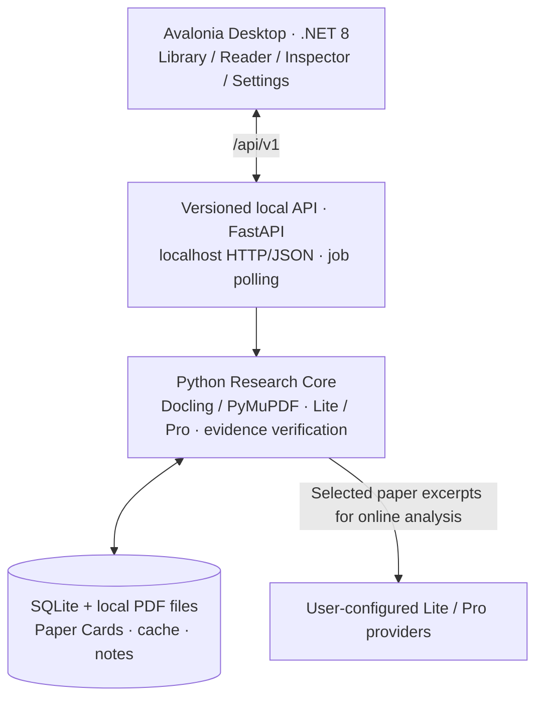

<p align="center">
  
</p>

<h1 align="center">Social Science Research IDE</h1>

<p align="center">
  <strong>From papers to auditable research understanding.</strong><br />
  从 PDF 到可追溯的主张、证据与方法学审读，而不只是另一份 AI 摘要。
</p>

<p align="center">
  <a href="https://github.com/daseinzc-509/social-science-research-ide/actions/workflows/ci.yml"></a>
  
  
  
  
  
  
</p>

<p align="center">
  <a href="#-为什么做-sra">为什么做 SRA</a> ·
  <a href="#-核心能力">核心能力</a> ·
  <a href="#-下载与使用">下载与使用</a> ·
  <a href="#-系统架构">系统架构</a> ·
  <a href="#-隐私与安全">隐私与安全</a> ·
  <a href="#-开发与测试">开发与测试</a> ·
  <a href="#-license--授权">License</a>
</p>

> [!IMPORTANT]
> **项目状态：Alpha / 持续开发。** Windows x64 与 macOS Apple Silicon 的桌面端、Python 后端联合打包流水线已加入仓库，但完整安装包仍须通过各平台原生构建、安装及真实 PDF 验收。不要将工作流存在等同于正式稳定版发布。**macOS Intel 暂不支持。**

---

## ✨ 为什么做 SRA

研究阅读真正困难的地方，往往不在于得到一段摘要，而在于回答：**作者究竟主张了什么？原文证据在哪里？结论在什么条件下成立？AI 的判断又根据什么作出？**

SRA（Social Science Research IDE）探索一种 **local-first、evidence-first** 的研究工作流：

- **保留可追溯来源**：让论文主张与 PDF 页码、段落、原文片段建立明确关联。
- **区分三种声音**：作者陈述、AI 方法学审读、研究者笔记不相互冒充。
- **分离两种“支持”**：找到来源（traceability）不等于该来源在语义上证明结论（semantic support）。
- **为继续研究而组织信息**：先形成可审计的单篇理解，再逐步扩展到多文献比较与研究写作。

**定位：个人研究阅读环境，而非自动生成可直接提交的论文综述。**

## 🔎 核心能力

| 模块 | 当前能做什么 |
| --- | --- |
| **PDF 理解** | Docling-first 版式恢复，PyMuPDF 后备，文本质量检测、必要时 OCR；保留 page / bbox / source block 信息。 |
| **结构化研究事实** | Lite 提取题名、作者、研究问题和论文事实；元数据按来源与版式规则核验。 |
| **独立方法学审读** | Pro 不只评价 Lite 摘要，还会从整篇文档定向回源，依据研究类型审查方法、限定与风险。 |
| **Claim × Evidence** | 记录主张类型、适用范围、证据角色与支持关系；可返回来源页和原文。 |
| **论文精读** | 将已有 Paper Card 确定性重排为连续阅读报告，不为了排版再调用一次模型。 |
| **研究工作台** | Avalonia 桌面端提供文献库、精读、事实证据、AI 审读、参考文献、设置与任务入口。 |
| **本地研究库** | SQLite、原始 PDF、解析结果与分析缓存；支持批量导入、重新分析及导出。 |

<details>
<summary><strong>学术审读具体区分了什么？</strong></summary>

| 层级 | 典型问题 | 说明 |
| --- | --- | --- |
| **Source location** | 这条论断是否准确指向 PDF 页与原文？ | `VerificationStatus` 只表示可定位性，不等于已证明。 |
| **Semantic relationship** | 原文支持、部分支持、限定还是反驳该说法？ | `SemanticSupportStatus` 属于模型辅助判断，需保留人工核查可能性。 |
| **Study profile** | 这是实验、观察性定量、质性、理论还是混合方法研究？ | 研究类型影响审读维度，而不是套用同一模板。 |
| **Method review** | 测量、识别、抽样、解释与外推有什么限制？ | 作者陈述与 AI 审读明确分开。 |

</details>

## 💻 下载与使用

**[GitHub Releases](https://github.com/daseinzc-509/social-science-research-ide/releases)** · **[构建与测试状态](https://github.com/daseinzc-509/social-science-research-ide/actions)**

| 平台 | 计划发布格式 | 当前说明 |
| --- | --- | --- |
| **Windows x64** | `Setup.exe` 安装器、便携 ZIP | 原生 CI 构建 + Python 后端捆绑；实际发布状态以 Releases 为准。 |
| **macOS Apple Silicon** | `.dmg`、`.app` ZIP | ARM64，macOS 14+；Alpha 包使用临时签名，**尚未完成 Apple Developer ID 公证**。 |
| macOS Intel / Linux | — | **暂不提供安装包**，不在当前发布矩阵。 |

> 如果 Releases 还没有可下载的版本，请使用下方**开发方式运行**。不要下载一个仅含 .NET 前端的旧 ZIP 并误以为其中已包含 Python 研究引擎。

**正式的捆绑版**计划在启动桌面应用时自动启动本地 Python API，无须另开终端；**源码开发模式**仍可手动启动 `sra api`。模型分析需要用户自己的 Lite / Pro 服务配置，部分 Docling 模型权重可能在首次运行时下载。

### 快速开始：Windows 源码开发

准备 Python 3.12、Conda，以及可以构建 `net8.0` / Avalonia 12 的 .NET SDK（本项目开发流程使用 .NET 10 SDK）。在项目根目录运行：

```powershell
conda create -p .conda-env -c conda-forge python=3.12 pip "pydantic>=2.7,<3" "pymupdf>=1.24,<2"
conda run -p .conda-env python -m pip install --no-build-isolation -e .
conda run -p .conda-env python -m pip install "fastapi>=0.115,<1" "uvicorn>=0.30,<1" "python-multipart>=0.0.9,<1" "httpx>=0.27,<1" "docling>=2.131,<3"
```

复制 `.env.example` 为**本地、不提交**的 `.env` 并配置模型（或使用桌面端设置页）：

```powershell
Copy-Item .env.example .env
```

在两个终端分别启动：

```powershell
# 终端 1：本地 API（开发模式）
conda run --no-capture-output -p .conda-env sra api
```

```powershell
# 终端 2：Avalonia 桌面应用
dotnet run --project .\desktop\SRA.Desktop\SRA.Desktop.csproj
```

也可以用旧版浏览器工作台调试：

```powershell
conda run --no-capture-output -p .conda-env sra ui
```

> 源码开发模式的本地 API 不等同于已加会话令牌保护的**捆绑版 API**；请只绑定回环地址，不要把开发端口公开到局域网或互联网。

### 常用 CLI

```powershell
conda run -p .conda-env sra import-pdf "D:\papers\example.pdf"
conda run -p .conda-env sra import-pdf-dir "D:\papers" --json
conda run -p .conda-env sra list
conda run --no-capture-output -p .conda-env sra analyze PAPER_ID
conda run -p .conda-env sra export-card PAPER_ID --output paper-card.json
conda run -p .conda-env sra export-reading-report PAPER_ID --output deep-reading.md
conda run -p .conda-env sra doctor --deep
```

命令以当前开发分支实现为准；如版本有所差异，请运行 `sra --help` 查看已安装的 CLI。

## 🧭 系统架构

**Avalonia 负责交互；FastAPI 提供本地边界；Python 承担研究理解；SQLite 保存研究状态。** 桌面界面不直接读写数据库，不把证据校验逻辑移植到 C#。



单篇论文处理流程：

```text
PDF
 └─ Parser / OCR → SourceBlock + page/bbox provenance
     └─ Evidence ledger
         ├─ Lite → metadata + author-stated claims
         ├─ Metadata provenance / deterministic checks
         └─ Research-type router → Pro independent retrieval + method review
              └─ PaperCard / ClaimAudit / SemanticSupport
                   ├─ Desktop views
                   └─ Deterministic deep-reading Markdown
```

### 设计约束

1. **Evidence First** — 所有可定位的原文证据都应保留来源位置。
2. **Traceability ≠ Entailment** — 一条证据被定位，不自动表示主张已获证明。
3. **Source separation** — 作者主张、AI 评价与用户笔记保持不同来源身份。
4. **Deterministic verification** — 页码、证据 ID、缓存与结构化校验优先交由代码处理。
5. **Human researcher in control** — 方法学审读是辅助判断，不替代学术复核。

### 主要目录

```text
.
├── desktop/SRA.Desktop/       # Avalonia UI / desktop lifecycle
├── src/sociology_research/    # Python models, parser, analyzer, library
│   ├── api/                   # Local HTTP API and DTOs
│   └── services/              # Application use cases
├── scripts/                   # Build, smoke tests, privacy / migration tools
├── installer/                 # Windows Inno Setup / macOS .app packaging
├── .github/workflows/         # Continuous integration and release pipeline
├── tests/                     # Parser / API / security / release regression
├── docs/                      # Release and security documentation
├── PROJECT_DESIGN.md          # Long-term product and research principles
└── README.md
```

## 🔐 隐私与安全

**本地保存**不等于**完全离线分析**。SRA 默认将论文、SQLite 数据库与模型配置留在当前用户的私有目录，但当用户启动在线 Lite / Pro 分析时，**选中的 PDF 文本片段会发送给所配置的模型服务商**。

| 类别 | Windows 捆绑版 | macOS Apple Silicon 捆绑版 |
| --- | --- | --- |
| 私人 PDF / 数据库 | `%LOCALAPPDATA%\SRA\data` | `~/Library/Application Support/SRA/data` |
| API Key | Windows DPAPI 当前用户加密 | macOS Keychain |
| 后端通信 | `127.0.0.1`、随机端口、进程级会话令牌 | 同左 |
| 公开发行包 | 不包含本人的 `.env`、PDF、SQLite | 同左 |

- 构建流水线对源码和安装产物执行敏感文件检查；**不要直接压缩整个开发目录发给别人**。
- `.env` 是旧源码开发兼容方式，可能包含明文凭据，**永远不要提交**。
- 更新检测只访问官方 GitHub Release 信息，提示用户安装，不静默执行下载的程序。
- 卸载默认保留个人研究数据，避免意外丢失；卸载程序与清除研究数据是两件事。
- macOS Alpha 包未经过 Apple 公证；首次打开可能需要在系统“隐私与安全性”中人工确认。

详细说明：[跨平台分发](docs/CROSS_PLATFORM_DISTRIBUTION.md) · [安全与私人数据](docs/SECURE_DISTRIBUTION.md) · [安装、更新与卸载](docs/INSTALL_UPDATE_UNINSTALL.md)

## 🧪 开发与测试

Pull Request / push 的 CI 设计为：**Python/API 回归 → 源码隐私扫描 → Windows 与 Apple Silicon Avalonia 编译**。完整后端冻结及安装器构建在 Release 工作流中进行，二者不要混为一谈。

```powershell
# Python 核心、API 与安全发布回归
conda run -p .conda-env python -m pytest -q tests\test_api_phase1.py tests\test_api_phase2.py tests\test_api_ui_parity.py tests\test_secure_distribution.py tests\test_desktop_release_pipeline.py tests\test_crossplatform_desktop.py

# 构建桌面端
dotnet build .\desktop\SRA.Desktop\SRA.Desktop.csproj

# 检查准备提交的源码是否包含私人材料
conda run -p .conda-env python scripts\check_release_safety.py source .
```

- [CI：自动测试与编译](https://github.com/daseinzc-509/social-science-research-ide/actions/workflows/ci.yml)
- [Release：Windows + macOS 捆绑版](https://github.com/daseinzc-509/social-science-research-ide/actions/workflows/release-desktop.yml)
- [提 Issue / 报告问题](https://github.com/daseinzc-509/social-science-research-ide/issues)

如果要贡献代码，建议先阅读 `PROJECT_DESIGN.md` 的研究原则，保持**可追溯性、来源分离、迁移安全和向后兼容**；修改解析器、模型输出结构或打包流程时，同时提交对应回归测试。

## 🗺️ 路线图

| 方向 | 状态 |
| --- | --- |
| 论文导入、PDF provenance、Lite / Pro 审读、精读报告 | **已实现基础工作流** |
| Avalonia 桌面工作台、本地 API、Windows + Apple Silicon 打包流水线 | **已实现 / Alpha 验证中** |
| 安装器原生验收、Docling 真 PDF 打包测试、macOS 签名与公证 | **待完成** |
| PDF × Claim/Evidence 双向定位、研究者确认与修正闭环 | **计划中** |
| 可量化 Eval Harness、跨论文 Evidence Matrix | **计划中** |
| Book Understanding、研究项目、多文献综合与综述辅助 | **远期方向** |

> **范围边界：** `SemanticSupportStatus` 属于可复核的模型辅助判断，而不是因果识别、统计显著性或研究结论的数学证明。研究者应对重要引文、解释与外部模型处理政策独立复核。

## 📚 项目文档

- [`PROJECT_DESIGN.md`](PROJECT_DESIGN.md) — 目标、原则与研究工作流。
- [`docs/CROSS_PLATFORM_DISTRIBUTION.md`](docs/CROSS_PLATFORM_DISTRIBUTION.md) — Windows/macOS 打包与发布限制。
- [`docs/SECURE_DISTRIBUTION.md`](docs/SECURE_DISTRIBUTION.md) — API Key、PDF、数据隔离和安全门禁。
- [`docs/INSTALL_UPDATE_UNINSTALL.md`](docs/INSTALL_UPDATE_UNINSTALL.md) — 更新、卸载与个人数据保留。
- [`docs/REPOSITORY_HYGIENE.md`](docs/REPOSITORY_HYGIENE.md) — 哪些目录该保留、忽略或安全清理。

## 📄 License / 授权

Original source code that its contributors have the right to license is
released under **[GNU AGPL-3.0-only](LICENSE)**. The license allows commercial
use but requires covered downstream modifications to honor its copyleft
obligations. It **does not** prohibit all commercial activity.

Project identity and artwork are discussed in [TRADEMARKS.md](TRADEMARKS.md).
Contributions: [CONTRIBUTING.md](CONTRIBUTING.md). Detailed notes:
[docs/LICENSING.md](docs/LICENSING.md).

**AI-assisted development.** SRA is maintained by a person and has been
built with significant AI assistance. The maintainer leads product decisions,
review and tests. The project makes no blanket claim of exclusive copyright
in purely AI-generated or third-party material; see the licensing notes.

---

<p align="center">
  <strong>Evidence before fluency. Researcher before automation.</strong><br />
  <sub>Social Science Research IDE · 本地优先的可审计学术理解工作台</sub>
</p>
