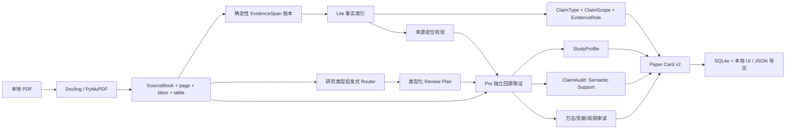
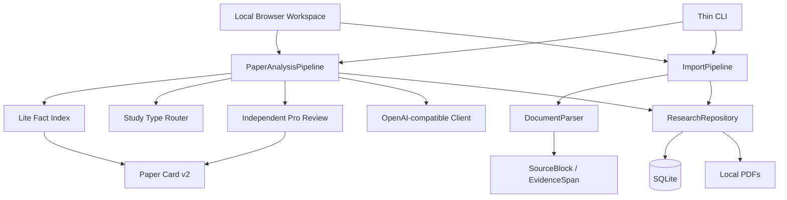

# Sociology Research Agent

**Sociology Research Agent (SRA)** 是一个本地优先、证据优先的社会科学论文工作台。它的目标不是“把 PDF 摘要得更长”，而是把论文中的**学术主张、来源证据、适用范围、语义支持程度与方法学风险**拆开保存，让研究者能够检查、质疑、修正并在之后重新使用。

当前版本已经从“可追溯摘要器”进入 **Paper Understanding v2 / 可审计的学术理解**阶段：单篇 PDF 不仅会生成事实卡片，还会建立研究画像、区分主张类型与范围、把“来源已定位”和“原文是否真的支持这条主张”分开，并让 Pro 阶段独立回到整篇论文中重新取证，而不是只能评论 Lite 已经选中的内容。

## 当前能力

- 单篇 PDF 导入、SHA-256 去重、本地归档。
- 多选/目录批量 PDF 入库；导入与模型分析分开，避免隐式消耗额度。
- Docling-first PDF 解析：版面、阅读顺序、表格、OCR、页码/bbox provenance；Docling 不可用时回退 PyMuPDF。
- 文本层质量检查：可疑乱码会触发更保守的处理，而不是仅凭“抽出了很多字符”判成功。
- Lite → Pro 两阶段分析与 SQLite 模型缓存。
- 确定性 EvidenceSpan 账本：模型只能引用程序提供的证据 ID，页码、块 ID、bbox 和逐字引文由程序恢复。
- Paper Understanding v2：
  - `ClaimType`：区分描述、相关、因果、机制、方法、测量、样本、理论等主张。
  - `ClaimScope`：记录 population、setting、time、subgroup、treatment/exposure、outcome、scope conditions。
  - `EvidenceRole`：区分核心证据、上下文、限定证据和表格证据。
  - `StudyProfile`：研究类型、设计、对象/样本、数据/材料、识别策略、测量策略等。
  - `ClaimAudit`：对 Lite 事实逐条做语义支持审计。
  - 研究类型路由：观察性定量、实验、质性、理论、mixed methods、综述使用不同审读重点。
  - Pro 独立回源：主动从整篇 SourceBlock 中提取 methods / results / limitations / robustness 等证据，不再只围绕 Lite 引文。
- 本地浏览器工作台：概览、事实与证据、AI 审读、参考文献、表格、原始 Card、元数据手工修订。
- 参考文献与正文引用提取，支持 JSON 与 Zotero BibTeX 导出。
- `sra doctor` / `sra prune-cache`：仓库健康检查、陈旧 prompt cache 检查与清理。

## 最重要的语义变化：Traceability ≠ Semantic Support

旧版 `VerificationStatus.SUPPORTED` 很容易被理解成“这条结论已经被论文证明”。实际上它只验证：模型引用的证据 ID 能否稳定映射回 PDF 原文。

为保持旧 Card 兼容，底层枚举值暂时仍保留 `SUPPORTED`，但 UI 将它显示为 **“来源已定位”**。真正的语义支持现在由独立字段表示：

```text
Traceability / verification
  SUPPORTED      -> UI: 来源已定位
  NEEDS_REVIEW   -> 来源待复核
  NO_SOURCE      -> 无来源

SemanticSupportStatus
  SUPPORTS            原文充分支持这条主张
  PARTIALLY_SUPPORTS  只支持主张的一部分
  QUALIFIES           原文包含会改变理解的重要限定
  CONTRADICTS         原文与主张冲突
  BACKGROUND_ONLY     只是相关背景，不能直接支持主张
  UNCLEAR             当前证据不足以判断
  NOT_ASSESSED        尚未做语义审计
```

因此一条事实完全可能同时是：

```text
verification = SUPPORTED        # 找到了原文
semantic_support = CONTRADICTS  # 但原文语义上不支持当前表述
```

这正是“可审计学术理解”和普通 PDF 摘要之间最关键的区别之一。

## Paper Understanding v2 数据流



Lite 仍负责**高召回、低成本的事实索引**，但它不再决定 Pro 能看到的全部世界。Pro 会根据论文类型，从整篇已解析 SourceBlock 中主动寻找方法、测量、结果、稳健性、局限与边界条件证据。

## 研究类型与方法学镜头

当前路由器是确定性的轻量启发式，只负责决定“先去哪里找证据、重点检查什么”；最终 `StudyProfile.study_type` 由 Pro 根据原文重新判断，可以纠正路由提示。

支持的主要类型：

- `quantitative_observational`：estimand、识别策略、混杂、选择、内生性、测量、稳健性、外推。
- `experimental`：随机化、处理/对照、依从、流失、power、多重检验、ITT/ATE、外部效度。
- `qualitative`：case selection、sampling、田野进入、coding、reflexivity、triangulation、negative cases、saturation。
- `theoretical`：assumptions、propositions、mechanism、scope conditions、可区分的经验含义。
- `mixed_methods`：分别检查定量和定性证据链，并检查二者如何整合。
- `review`：检索、纳排、筛选、编码、偏倚、异质性与综合方法。

## 快速开始

```powershell
conda create -p .conda-env --override-channels -c conda-forge python=3.12 "pydantic>=2.7,<3" "pymupdf>=1.24,<2" pip
conda run -p .conda-env python -m pip install --no-build-isolation -e .

# 推荐解析器；安装后 auto 会优先选择 Docling
conda run -p .conda-env python -m pip install "docling>=2.131,<3"

# 导入与查看
conda run -p .conda-env sra import-pdf "D:\papers\example.pdf"
conda run -p .conda-env sra import-pdf-dir "D:\papers" --json
conda run -p .conda-env sra list
conda run -p .conda-env sra show PAPER_ID

# 本地 UI
conda run --no-capture-output -p .conda-env sra ui

# 分析：默认只是本地预览，不调用模型
conda run --no-capture-output -p .conda-env sra analyze PAPER_ID

# 真正运行 Lite + 独立 Pro 审读
conda run --no-capture-output -p .conda-env sra analyze PAPER_ID --run

# 可选研究上下文：只影响阅读相关性，不改变论文事实
conda run --no-capture-output -p .conda-env sra analyze PAPER_ID --research-context "我的研究问题" --run

# 相邻文章/合刊 PDF 可显式截断
conda run --no-capture-output -p .conda-env sra analyze PAPER_ID --exclude-after-text "下一篇文章标题" --run

# 导出
conda run -p .conda-env sra export-card PAPER_ID --output paper-card.json
conda run -p .conda-env sra export-text PAPER_ID --output parsed-paper.txt
conda run -p .conda-env sra extract-references PAPER_ID --output references.json
conda run -p .conda-env sra export-references PAPER_ID --output references.bib --format bibtex

# 健康检查 / 缓存
conda run -p .conda-env sra doctor
conda run -p .conda-env sra doctor --deep
conda run -p .conda-env sra prune-cache
```

`conda run` 不要求先初始化 PowerShell。更新代码后，需要重启已经运行的 UI 进程。

## 模型配置

项目从环境或根目录 `.env` 读取：

```text
SRA_API_KEY
SRA_API_BASE_URL
SRA_LITE_MODEL
SRA_PRO_MODEL
```

客户端使用 OpenAI-compatible Chat Completions JSON 输出。模型名按配置原样发送，不在代码中重写。

默认分析策略位于 `config.py -> AnalysisConfig`：

```text
request_timeout_seconds = 420
lite_thinking = disabled
pro_thinking = enabled
pro_reasoning_effort = low
pro_evidence_char_limit = 24000
pro_direct_review_span_limit = 96
```

Lite 保持紧凑、低成本；Pro 的预算增加，是因为 v2 不仅要评论 Lite，还要独立回源、生成研究画像并逐条审计事实语义支持。

## Paper Card v2 的核心结构

简化后可以理解为：

```json
{
  "metadata": {},
  "basic_facts": [
    {
      "claim_id": "clm_...",
      "field_name": "major_finding",
      "statement": "...",
      "claim_type": "ASSOCIATION",
      "scope": {
        "population": "...",
        "setting": "...",
        "time_scope": "...",
        "subgroup": null,
        "exposure_or_treatment": "...",
        "outcome": "...",
        "conditions": []
      },
      "verification": "SUPPORTED",
      "semantic_support": "QUALIFIES",
      "support_note": "原文只在某个子样本中成立……",
      "evidence": [
        {"evidence_id": "ev_...", "role": "ANCHOR", "page_number": 8, "quote": "..."},
        {"evidence_id": "ev_...", "role": "QUALIFIER", "page_number": 9, "quote": "..."}
      ]
    }
  ],
  "study_profile": {},
  "claim_audits": [],
  "review_plan": [],
  "analysis": [],
  "limitations": []
}
```

`PaperCard` 现在更明确地是**研究记忆的可读视图**。底层仍保留 `SourceBlock`、`EvidenceSpan` 和稳定 `claim_id`，为以后把 Claim / Evidence / StudyProfile 独立持久化打基础。

## 缓存与升级说明

本版 prompt version：

```text
paper-understanding-v12-auditable
```

旧 Paper Card 仍可读取：新增字段都提供了兼容默认值，不需要数据库迁移才能打开旧卡片。

但旧卡片不会自动拥有 `StudyProfile`、`ClaimAudit`、`ClaimType`、`ClaimScope` 等新信息。要生成 v2 内容，请对论文执行一次**重新分析**。新的 prompt version 会使用新的模型缓存键；`sra doctor` 会把旧 prompt cache 显示为 stale，可用 `sra prune-cache` 清理。PDF 和 SourceBlock 不会因为 prompt 升级而被删除。

如果 parser version 变化，现有逻辑仍会重新解析 PDF，并清除依赖旧解析结果的 Paper Card / 模型缓存，避免新旧 provenance 混用。

## PDF 解析

默认：

```text
SRA_PDF_PARSER=auto
```

`auto` 在 Docling 可用时优先使用 Docling，否则回退 PyMuPDF。也可以显式设置：

```text
SRA_PDF_PARSER=docling
SRA_PDF_PARSER=pymupdf
```

Docling 负责语义文档项、阅读顺序、表格、OCR 与 bbox provenance。解析层还会检查文本质量；字符数量足够但明显乱码的文本层不再直接视为可信。

需要强调：**PDF 字符提取成熟，不等于学术语义结构恢复已经完全解决。** 标题、页眉、脚注、印刷页码、跨栏顺序、表格、扫描文本和出版版式仍可能要求确定性恢复或人工复核。

## 参考文献

当前实现区分：

1. `ReferenceEntry`：文末参考文献条目，保留原始文本与结构化字段。
2. `CitationMention`：正文中的引用位置与附近上下文。
3. 后续 `ReferenceLink`：与本地论文、DOI 或外部元数据的候选匹配关系。

当前已经可以提取、保存并导出前两者。完整引用网络、外部 citation context 和自动文献发现仍属于后续能力。

## 架构边界



当前仍然坚持单体 Python 工作流，不因为项目名里有 “Agent” 就提前引入多 Agent / LangGraph。只有出现真实的长流程恢复、条件分支、人工闸门和任务编排需求时，再评估工作流框架。

## 当前限制

Paper Understanding v2 提升的是**审计性与研究结构**，不是宣称 AI 已经可以自动完成学术判断：

- `SemanticSupportStatus` 仍是模型基于所选原文做出的判断，必须允许人工复核；它不是形式证明。
- 研究类型 Router 是启发式，用于取证和选择 rubric；Pro 可以纠正，但极不标准的论文仍可能路由不准。
- 当前独立回源是确定性关键词/结构取证，不是向量检索或完整语义检索。只有评估证明需要时才引入 Retrieval Interface。
- 还没有把 Claim / Evidence / StudyProfile 拆成独立 SQLite 规范化表；当前先以兼容的 Paper Card JSON 演进，避免过早迁移复杂度。
- 论文身份元数据仍主要来自 PDF / 版式恢复；DOI/Crossref/CNKI/OpenAlex authority resolver 尚未成为稳定主链路。
- 单篇论文内部审读不能替代跨论文比较，因此不能仅凭当前 Card 判断“领域共识”“真正创新”或“外部可复制性”。

## 下一步优先级

下一阶段不优先堆搜索或自动综述功能，而是继续提高研究记忆本身的可靠性：

1. **Eval Harness**：建立人工标注的多类型社会科学论文基准；分别评估事实召回、claim type、scope、来源定位、semantic support、StudyProfile 与方法学审读。
2. **Human Review State**：在 UI 中允许研究者确认/修正 claim、scope、semantic support，并把人工状态与模型状态永久分开保存。
3. **Evidence Matrix**：跨论文时先比较 population / method / claim / scope / support，而不是直接生成长综述。
4. **External Challenge Layer**：在已有 claim ID 基础上接 DOI/metadata/citation context，回答“后续研究如何支持、限定或反驳这条主张”。
5. **Research Memory normalization**：当多论文查询需求真实出现后，再把 Claim / Evidence / StudyProfile 从 Paper Card JSON 迁移为独立可查询实体。

项目的核心判断仍然是：

> **不是让 AI 把论文解释得更长，而是把论文中的主张、证据、推断边界和方法学风险拆得足够清楚，使研究者以后可以可靠地比较、质疑和重新使用。**
