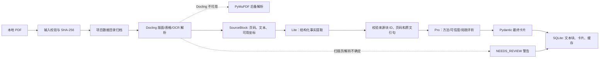
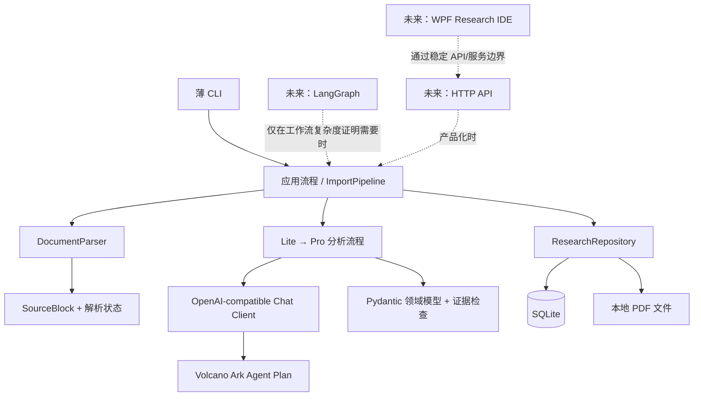

# Sociology Research Agent

本项目从一个本地、可追溯的社会科学论文阅读原型开始。当前框架支持单篇 PDF 导入与解析、Lite → Pro 两阶段结构化分析、证据核验、SQLite 缓存和 Paper Card JSON 导出。批量 PDF 入库和参考文献结构化已经列入下一阶段设计，但尚未作为稳定 CLI 能力发布；自动搜索、跨论文综合和桌面界面也尚未接入。

## 快速开始

```powershell
conda create -p .conda-env --override-channels -c conda-forge python=3.12 "pydantic>=2.7,<3" "pymupdf>=1.24,<2" pip
conda run -p .conda-env python -m pip install --no-build-isolation -e .
# 当前首选解析器（已安装时由 auto 自动选用）
conda run -p .conda-env python -m pip install "docling>=2.131,<3"
conda run -p .conda-env sra import-pdf "D:\papers\example.pdf"
conda run -p .conda-env sra list
conda run -p .conda-env sra show PAPER_ID
conda run --no-capture-output -p .conda-env sra ui
conda run --no-capture-output -p .conda-env python scripts/test_ark_connection.py
conda run --no-capture-output -p .conda-env sra analyze PAPER_ID
conda run --no-capture-output -p .conda-env sra analyze PAPER_ID --exclude-after-text "Revisiting Description: Data Deep Description in Quantitative Research"
conda run --no-capture-output -p .conda-env sra analyze PAPER_ID --exclude-after-text "Revisiting Description: Data Deep Description in Quantitative Research" --run
conda run -p .conda-env sra export-card PAPER_ID --output paper-card.json
conda run -p .conda-env sra export-text PAPER_ID --output parsed-paper.txt
conda run -p .conda-env sra import-pdf-dir "D:\papers" --json
conda run -p .conda-env sra extract-references PAPER_ID --output references.json
conda run -p .conda-env sra export-references PAPER_ID --output references.bib --format bibtex
```

`conda run` 不要求先初始化或激活 PowerShell。项目依赖版本范围也记录在 `pyproject.toml`。

也可以双击项目根目录的 [`start_sra_ui_fixed.bat`](start_sra_ui_fixed.bat) 启动本地浏览器工作台。启动脚本固定使用 `8766` 端口；界面服务只绑定本机回环地址，不是公开部署的 Web 服务。工作台顶部的“批量导入 PDF”支持多选文件；论文详情中的“参考文献”标签支持提取、查看、导出 JSON 和导出 Zotero BibTeX。更新代码后需要重启已经运行的 UI 进程。

## 模型配置

项目根目录的 `.env` 已加入忽略规则，不会随代码提交。把密钥放入 `SRA_API_KEY`；可参考 [.env.example](.env.example)。也可在 PowerShell 当前会话设置 `$env:SRA_API_KEY = "你的密钥"`。代码从环境读取密钥，不打印密钥值。

当前使用火山方舟 Agent Plan 的 OpenAI-compatible Chat Completions，模型名按配置原样发送：`doubao-seed-2.1-lite` 与 `doubao-seed-2.1-pro`。

论文分析分为两个阶段：

```text
PDF 文本块 + 页面证据
  → Lite：元数据、摘要、方法、数据集、指标、表格和关键数字
  → 紧凑基础卡片（每项保留证据引用）
  → Pro：创新点、方法合理性、实验可信度、局限、阅读价值
  → 最终 Paper Card（保留阶段来源和证据）
```

`sra analyze` 默认只做本地预览，显示模型、思考设置、Lite 请求数和输入长度，不发送请求。只有加 `--run` 才调用模型、消耗 Agent Plan 额度；不会自动重试。Lite 默认关闭深度思考以降低提取延迟与用量；Pro 保持思考开启并使用 low reasoning effort。Lite 只输出受限数量的论文事实，表格本体由 PDF 解析器保存，避免模型重复抄写整张表。超时和思考参数放在 [config.py](src/sociology_research/config.py) 的 `AnalysisConfig`，不作为环境变量。`conda run` 默认会缓存子进程输出，模型调用时建议加 `--no-capture-output` 查看实时进度。模型请求不逐 token 流式返回，等待时会每 30 秒显示状态。超时默认为 420 秒。Lite 使用紧凑来源别名减少重复 UUID 的输入开销，Pro 只接收 Lite 结果和精选引文，不重传整篇 PDF。Lite 结果按论文、模型、提示版本和输入内容缓存；Pro 超时后重跑会复用已成功缓存的 Lite 结果。`--force --run` 会强制重跑并消耗额度。研究兴趣是可选项，只影响阅读相关性判断，不影响论文事实提取或方法分析。

`scripts/test_ark_connection.py` 发送一条极短请求，仅验证 Key、Base URL、所选模型和 Chat Completions 连通性；它仍会消耗少量额度，但不会发送论文文本，也不会自动重试。默认测试 Lite；用 `--stage pro` 测试 Pro。

数据默认保存在项目根目录的 `data/`：导入的 PDF 在 `data/papers/`，SQLite 数据库在 `data/research.sqlite3`。可用 `SRA_DATA_DIR` 指向其他数据目录。重复导入相同文件内容会复用已有记录。

当前默认解析器是 Docling：它负责版面、阅读顺序、表格和扫描页 OCR，并把页码与 bbox provenance 保存到 `SourceBlock`。如果 Docling 不可用，`auto` 才回退到 PyMuPDF；也可以通过 `SRA_PDF_PARSER=docling` 或 `SRA_PDF_PARSER=pymupdf` 显式选择。扫描 PDF、无法提取文字的页面、复杂表格或解析状态异常会标记为 `needs_review`，损坏、加密或不支持的输入会明确报错。

## 当前数据流程



## 下一阶段：批量 PDF 与参考文献

### 批量 PDF 入库

批量提交的第一目标是把一组 PDF **可靠地放入论文库**，而不是一上传就同时调用模型。目标流程是：

```text
文件夹 / 多选 PDF
  → 扫描与扩展名校验
  → SHA-256 去重
  → 逐文件复制、解析、写入 SQLite
  → 返回每个文件的成功、重复、失败或需复核状态
  → 用户选择后再批量分析
```

批量任务必须保留逐文件结果。一个损坏的 PDF 不应让同一批次的其他文件丢失；重复文件只关联已有论文记录，不创建第二份数据库记录。默认导入与分析分开，避免一次提交意外消耗模型额度。

批量入库和参考文献命令已经接入；批量导入只负责入库，不自动调用模型：

```text
sra import-pdf-dir PATH              # 递归扫描目录并批量入库
sra import-pdf-dir PATH --no-recursive
sra extract-references PAPER_ID --output references.json
sra export-references PAPER_ID --output references.bib --format bibtex
```

### 参考文献要处理到什么程度

这里要区分三个对象：

1. **参考文献表条目**：论文末尾的每一条参考文献，先保存原始字符串，再尽量解析作者、年份、标题、期刊、卷期、页码、DOI 等字段。
2. **正文引用位置**：正文中的 `(Author, 2020)`、`[12]` 或脚注引用，记录它出现在哪一页、哪一个文本块以及附近句子。它回答“作者在什么论证位置引用了谁”。
3. **论文库匹配关系**：把参考文献条目与本地已导入论文、DOI、Crossref/OpenAlex 元数据进行匹配。匹配不到时保留未解析条目，不强行创建论文。

当前实现从 Docling 已保存的 `SourceBlock` 中识别参考文献区段、编号引用和作者-年份引用，并把不确定项标成需复核。BibTeX 导出可以直接导入 Zotero；JSON 是项目内部保留页码和原文证据的格式。完整引文网络、影响力排名和自动判断“谁影响了谁”仍放到更后面。

推荐的参考文献记录至少保留：`paper_id`、`reference_id`、`raw_text`、`parsed_fields`、`source_page`、`source_block_id`、`citation_mentions`、`match_status`、`matched_paper_id`、`needs_review_reason`。原始字符串和解析结果必须同时保存，方便人工纠错和替换解析器。

## 架构边界



批量入库仍然复用现有 `ImportPipeline` 和 `ResearchRepository`，新增的只是目录扫描、任务结果和逐文件状态；它不应复制一套 PDF 哈希、存储或解析逻辑。参考文献解析应作为独立的 `ReferenceExtractor` 边界接入，先使用可复现的 PDF 结构解析器，再把模型用于规范化、候选匹配和需要人工复核的解释。

## 下一步构建方向

下一步优先做一个总控制面板：按“待解析、待分析、待提取参考文献、需人工复核、已完成”管理论文队列；支持勾选多篇论文后批量运行 Lite → Pro、批量提取参考文献、查看失败原因和重试。论文详情页只保留一个“提取/刷新参考文献”按钮，避免重复入口造成困惑。之后再加入跨论文比较、引用关系确认和 Zotero 双向同步。

当前项目的运行时验证以 `sra doctor`、真实 PDF 样本和本地 UI 操作为主；单独运行 `sra analyze` 才会访问方舟并消耗 Agent Plan 额度。

详细的产品原则和阶段规划见 [PROJECT_DESIGN.md](PROJECT_DESIGN.md)。
